# Ray Tracer

A physically-based renderer with parallel **CPU**, **GPU (OptiX)** (Windows + NVIDIA) and **GPU (Metal)** (macOS) implementations, built up from the "Ray Tracing in One Weekend" book series into a much broader pbrt-v4-style feature set: 151 built-in scenes plus over 170 bundled pbrt example scenes, a wide material library, multiple light types, real triangle-mesh/texture support, BVH acceleration, volumetrics, and an experimental SPPM (photon-mapping) integrator alongside standard path tracing.


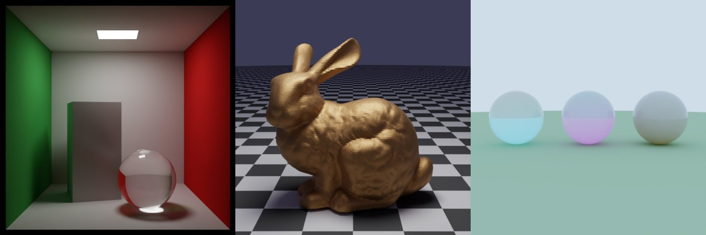

## 🖼️ Gallery

Rendered with this project: 720 x 720, 2048 samples per pixel, max depth 12, the OptiX GPU backend on an RTX 5080, with the OptiX AI denoiser at blend 0.1 (so a little grain is kept). The time is the renderer's own "RENDER TIME" (denoising included). Every scene is built in; the id in brackets is the scene id the command line and the GUI use (for example `ray_tracer.exe --gpu --denoise 720 2048 12 A1`).

| | | |
|:-:|:-:|:-:|
| 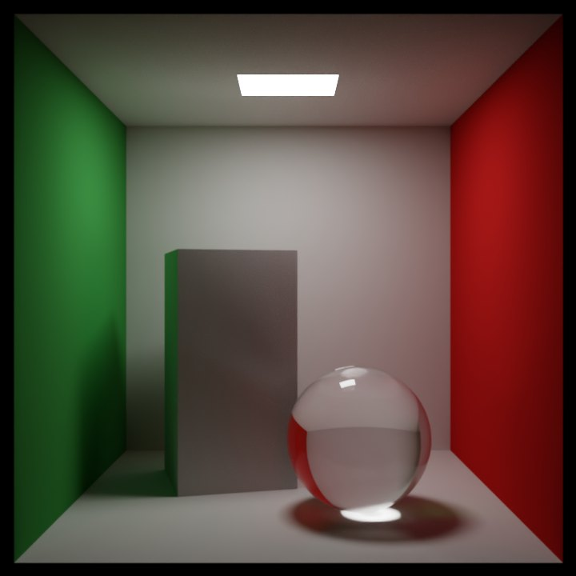<br>**Cornell box (A1)**<br>glass sphere, aluminium box, caustic<br>6 s | 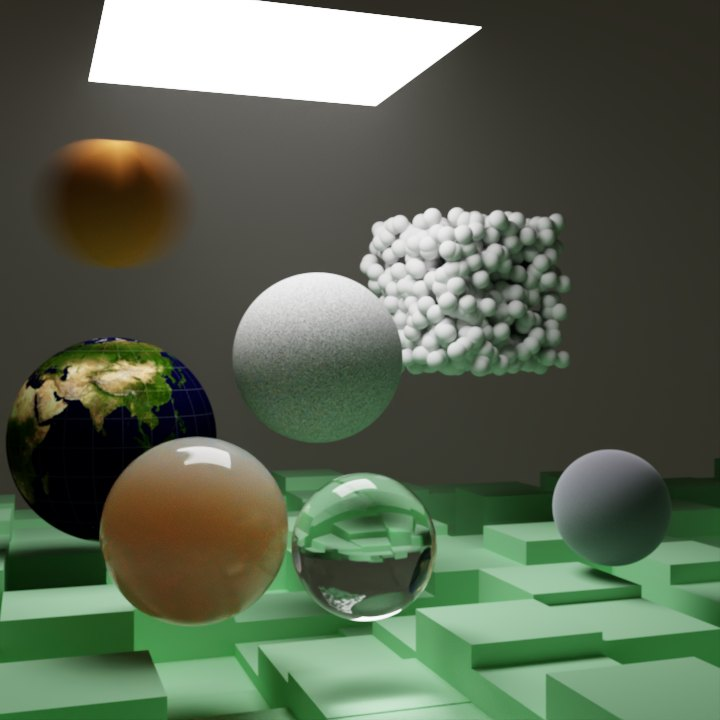<br>**Final scene (A9)**<br>the "Next Week" cover scene: volumes, earth map, glass, noise<br>15 s | 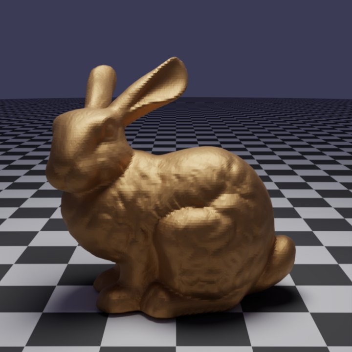<br>**Stanford bunny (G1)**<br>69k triangles, polished bronze<br>5 s |
| 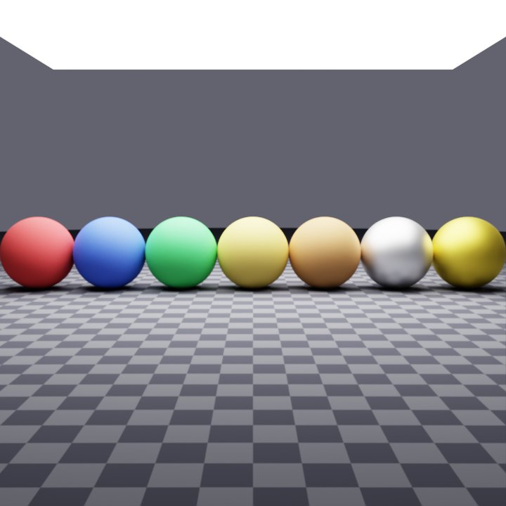<br>**Principled BSDF (B10)**<br>matte plastic to clear-coated metal<br>4 s | 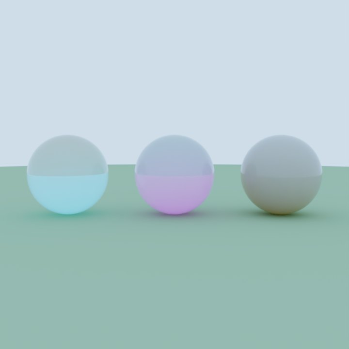<br>**Glass with fog (E3)**<br>coloured scattering media inside dielectrics<br>3 s | 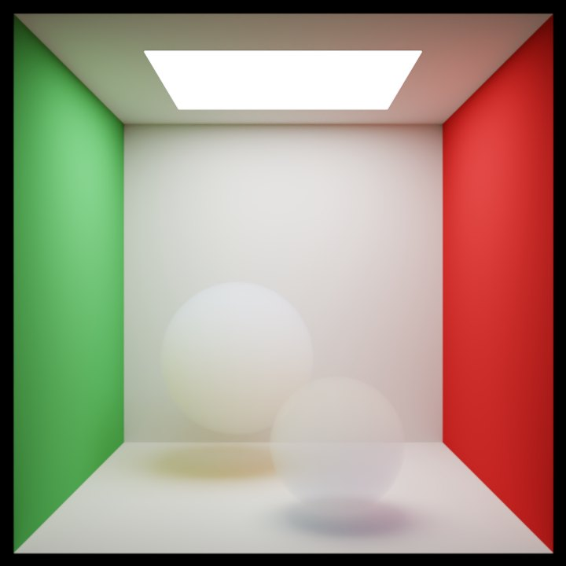<br>**Cornell smoke (A8)**<br>participating media, multiple scattering<br>8 s |
| 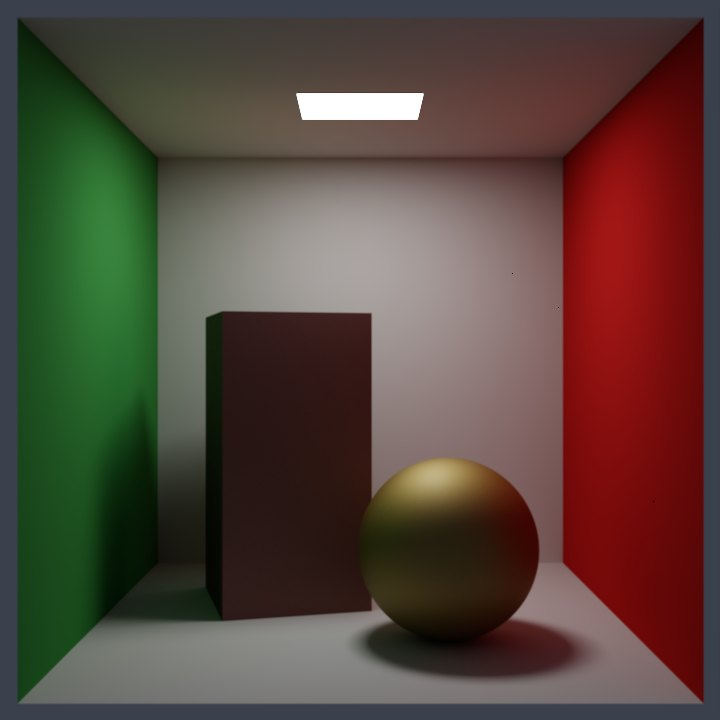<br>**Coated conductor (B7)**<br>pbrt-v4 layered BxDF: lacquered gold<br>22 s | 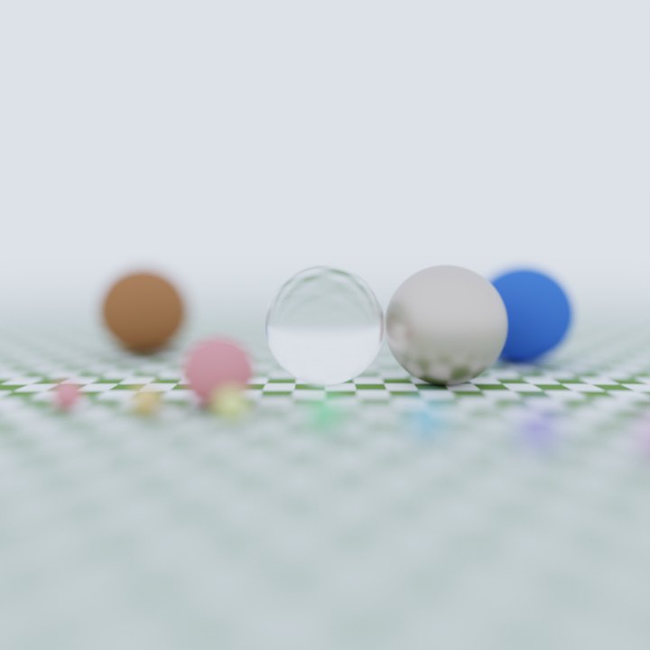<br>**Depth of field (D1)**<br>thin-lens camera<br>3 s | 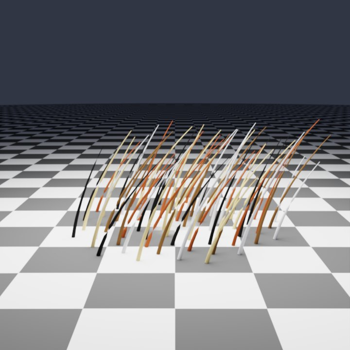<br>**Curve fibres (F4)**<br>real Bezier strand geometry<br>10 s |
| 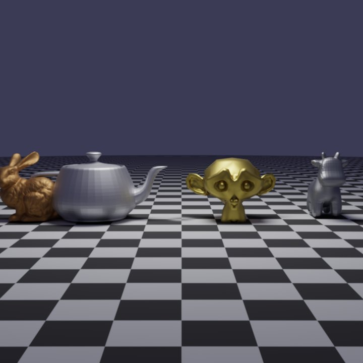<br>**Trophy room (G12)**<br>four meshes, mixed materials<br>4 s | 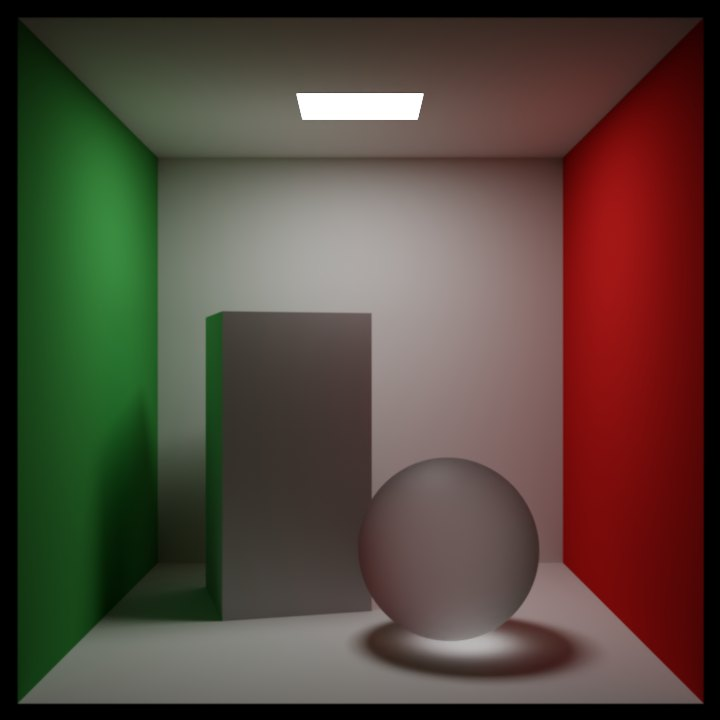<br>**Rough glass (B3)**<br>GGX rough dielectric<br>7 s | 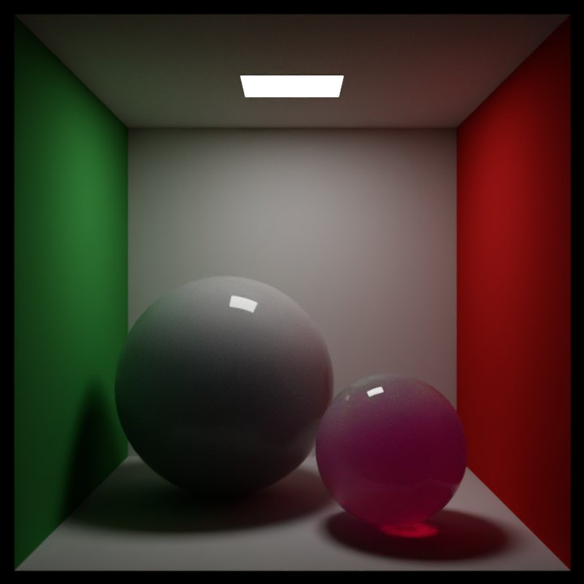<br>**Wax and jade (B13)**<br>subsurface-like translucency<br>10 s |

## ✅ How the renders are checked

A rendering bug is quiet: the picture still looks plausible while being 20% too dark. So the test suite checks absolute numbers, not only that the backends agree with each other.

- **Closed forms.** Furnace scenes (a diffuse sphere under a white sky must read its albedo), a closed diffuse-transmission shell (0.2, 0.56, 0.632, 0.6464 ... 0.65), per-channel Beer-Lambert absorbers, and a point light over a plate are read by the CPU, both OptiX backends and the alternative integrators.
- **Cross-checks.** The CPU path tracer against the two OptiX backends and Metal, and BDPT, MLT, SPPM and the debug integrators against the path tracer, on purpose-built scenes.
- **pbrt-v4 as the reference.** Where behaviour is in doubt, the pbrt-v4 source is read, and an independent script (`scripts/pbrt_rough_glass_reference.py`) provides a path-level reference for rough glass.
- **Over 5,000 automated tests**, under ten minutes on a desktop GPU. [`docs/PBRT_SUPPORT.md`](docs/PBRT_SUPPORT.md) lists, feature by feature and backend by backend, what is supported and how closely it matches.

How this found more than a dozen bugs that a plain backend-versus-backend comparison could not see: [Closed forms found the bugs](docs/CLOSED_FORMS_FOUND_THE_BUGS.md).

## ⚡ Try it in a few minutes, no NVIDIA GPU needed

The CPU renderer is a complete renderer and builds with plain CMake and a C++17 compiler (on Windows, Visual Studio with the C++ workload). No CUDA, OptiX or Qt is needed:

```bash
git clone --depth 1 https://github.com/XinpeiWang/ray_tracer
cd ray_tracer
cmake -S . -B build
cmake --build build --config Release --target ray_tracer
# run from the repository root, so the scenes and textures are found:
build/Release/ray_tracer --cpu --output cornell.png 400 128 8 A1      # Windows (Visual Studio generator)
build/ray_tracer          --cpu --output cornell.png 400 128 8 A1      # macOS and other single-config generators
```

That renders the Cornell box (A1) at 400 px with 128 samples per pixel and depth 8: about 5 seconds on a 16-core desktop CPU (the build took under a minute). The arguments are `[width] [samples] [max depth] [scene id]`; `--gpu` on a build without GPU support falls back to the CPU with a warning. Add `-DRT_BUILD_GPU=ON` (Windows with CUDA and OptiX) or `-DRT_BUILD_METAL=ON` (macOS) to the first `cmake` line for the GPU backends, or use the portable release below.

## 🧱 Build your own scene

The GUI has a **Scene Builder** tab: add spheres, boxes, quads, cylinders, cones, meshes and lights, pick materials (matte, metal, glass, glossy paint, translucent) and colours, drag things around in a top, front or side view, press Preview, and save the result as an ordinary `.pbrt` file that the renderer and any pbrt-compatible tool can read. See [docs/SCENE_BUILDER.md](docs/SCENE_BUILDER.md).

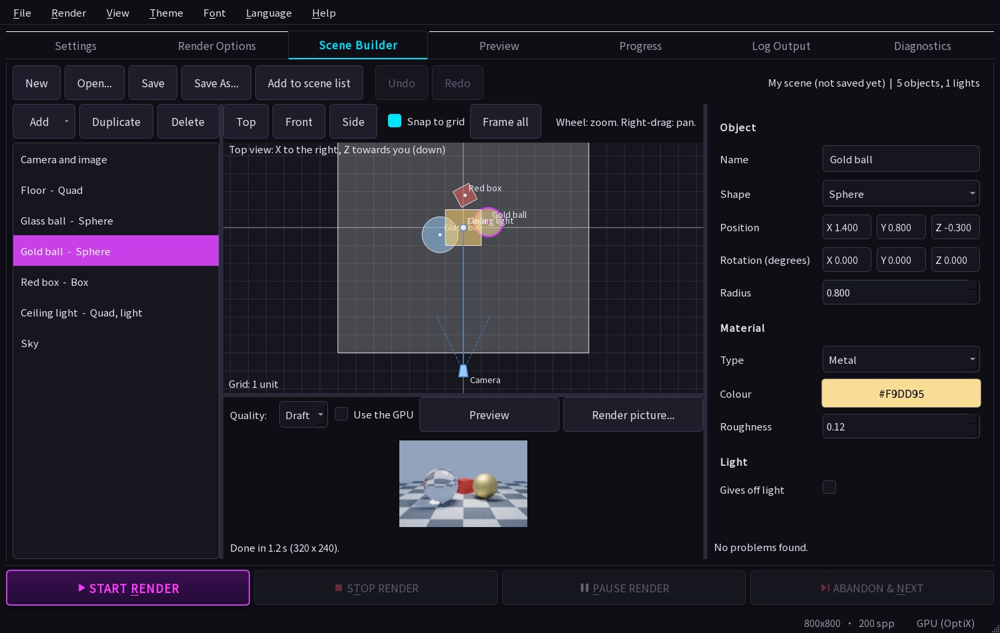

## 📦 Download & Use (No Build Required!)

**Want to try it without building?** Download the portable release:

1. [Download the latest portable release](../../releases) from the Releases page
2. Extract to any folder
3. **GUI Version:** Double-click `RayTracerGUI.exe` for a graphical interface
   - OR **Console Version:** Run `RayTracer.exe` from a terminal for command-line rendering

The portable version includes:
- ✅ **Graphical User Interface** - Easy point-and-click rendering
- ✅ All required runtime dependencies (CUDA, Visual C++)
- ✅ Automatic GPU/CPU detection
- ✅ Interactive parameter selection (GUI or console)
- ✅ No installation needed - fully portable!

See [INSTALL.md](INSTALL.md) for detailed usage instructions.

**macOS:** a `RayTracerGUI.dmg` (Metal GPU rendering and Live Preview included; native on Apple silicon; `--arch universal` builds one dmg for Apple-silicon and Intel Macs) is built by `scripts/build_and_deploy_macos.sh` — see [macOS](#macos). It is not code-signed, so on first launch right-click the app → **Open**.

## 🔨 Building from Source

**Cloning:** the full history is about 440 MB, because older commits contained generated GPU code and release archives that are no longer tracked. If you only want the code, take a shallow clone: `git clone --depth 1 https://github.com/XinpeiWang/ray_tracer` downloads about 52 MB (150 MB checked out).

**Quick build:**
```powershell
# From Visual Studio Developer PowerShell
.\scripts\build_and_deploy.ps1
```

For detailed build instructions, see **[BUILD.md](BUILD.md)**.

## 🎯 Features

### Core Rendering
- ✅ **Path tracing** with next-event estimation and multiple importance sampling (power heuristic)
- ✅ **BVH acceleration** on both CPU and GPU (SAH-based CPU BVH; OptiX's native BVH/GAS on GPU) — not a linear scan
- ✅ **151 built-in scenes plus over 170 bundled pbrt example scenes** (category-letter + number ids, e.g. `A1`, `B10`, `G25`, `K42`) spanning the "Ray Tracing" book series, a pbrt-v4-style material/light/camera showcase, dozens of real-world statue/object meshes, and several "movie-level" environment scenes (Sponza, Amazon Lumberyard Bistro, Rungholt, Fireplace Room, San Miguel, Sibenik Cathedral, Breakfast Room, Salle de Bain, Gallery) — see [Scenes](#-scenes) below
- ✅ **Real triangle meshes**: OBJ loading with BVH, per-face `.mtl` materials, and real `map_Kd` image-texture sampling (not just flat colors) on both CPU and GPU
- ✅ **Stochastic Progressive Photon Mapping (SPPM)**, an alternative integrator for hard caustic/glass scenes a standard path tracer struggles to converge — on the CPU, and on the GPU for sphere/quad scenes (see [Known Limitations](#-known-limitations))
- ✅ **Bidirectional Path Tracing (BDPT) and Metropolis Light Transport (MLT)**, additional alternative integrators (CPU-only, `--bdpt`/`--mlt`) for scenes with difficult light transport
- ✅ **Adaptive sampling** (`--adaptive`): stops sampling pixels that have already converged (CPU; opt-in on Metal)
- ✅ **Volumetric media**: homogeneous participating media, procedural (Perlin-noise) cloud/fog, and heterogeneous NanoVDB grid media (CPU-only)
- ✅ **Anti-aliasing** through multi-sampling, **ACES filmic tone mapping** + sRGB output

### Materials
Lambertian, Metal, Dielectric (smooth and rough), Conductor (GGX + complex Fresnel), Coated Diffuse/Conductor (clear-coat layering), Thin Dielectric, Diffuse Transmission, Normalized Fresnel, Principled (Disney-style multi-lobe), Hair (Marschner/Chiang fiber scattering), Measured (real importance-sampled pbrt-v4 `MeasuredBxDF`, loaded from a `.bsdf` tensor file), Subsurface (tabulated BSSRDF), Normal/Bump mapping, homogeneous participating media (plus rough/thin-dielectric+medium fusion for a single shape that's both a refractive boundary and a scattering volume), and mixed materials — see `docs/` and `src/TheRestOfYourLife/material_*.h` for details.

### Lighting
Area lights (quad/sphere), point/spot/distant (sun) punctual lights, goniometric (IES-profile) lights, projection lights, procedural sky, and image-based HDRI environment lighting (including portal-sampled HDRI through a window).

### Cameras
Pinhole, depth-of-field (thin-lens), orthographic, spherical/equirectangular 360°, and a realistic multi-element lens camera (double-Gauss, real exit-pupil sampling) — all with both CPU and GPU support.

### Video Generation 🎬
- ✅ **Animated camera paths**: orbit, linear, figure-8, spiral
- ✅ **Multi-frame rendering** with automatic frame numbering
- ✅ **MP4 video assembly** via an `ffmpeg` subprocess (requires `ffmpeg` on `PATH`)
- ✅ **Configurable FPS, speed, and quality** settings
- 📖 See [docs/VIDEO_GENERATION.md](docs/VIDEO_GENERATION.md) for detailed usage

### Dual Rendering Modes
- **CPU Renderer**: Multi-threaded, importance-sampled, the most feature-complete and battle-tested path
- **GPU Renderer**: OptiX-accelerated, dramatically faster for complex scenes — has near-complete feature parity with CPU (see [Known Limitations](#-known-limitations) for the remaining gaps), plus an alternate queue-based **wavefront** path tracer (opt-in via `--wavefront`)
- **Metal GPU Renderer** (macOS): a Metal path tracer (`gpu/metal/`, `--gpu` on a `-DRT_BUILD_METAL=ON` build) checked against the CPU renderer scene by scene — see [`docs/METAL_PARITY_STATUS.md`](docs/METAL_PARITY_STATUS.md) for exactly what matches and what doesn't

### Qt GUI
Scene picker with live metadata (description, GPU compatibility, perf hint), camera presets, quality/resolution presets, GPU/CPU toggle, image vs. video mode with camera-path selection, a render queue, and one-click render. On macOS, **Live Preview** renders continuously on the Metal GPU so you can drag to orbit the camera (see [`docs/MAC_LIVE_PREVIEW.md`](docs/MAC_LIVE_PREVIEW.md)). The interface is translated into English, Spanish, French, Japanese and Simplified Chinese (Language menu, applied on restart) and has selectable themes and fonts.

## 📊 Performance

**Cornell Box Scene (800×450 resolution, 10 samples/pixel):**

| Renderer | Hardware | Time | Speedup |
|----------|----------|------|---------|
| CPU | AMD/Intel (multi-threaded) | ~5-10s | 1× |
| GPU | NVIDIA RTX 5080 | ~50ms | **100-200×** |

**GPU Performance by Resolution (RTX 5080):**

| Resolution | Samples | Kernel Time | FPS (equiv) |
|------------|---------|-------------|--------------|
| 400×225    | 2       | 2.5ms       | ~400 fps    |
| 800×450    | 4       | 9.6ms       | ~100 fps    |
| 1920×1080  | 10      | ~100ms      | ~10 fps     |

Large environment scenes (Bistro's 2.84M triangles + ~1.9GB of texture data) are naturally much slower to build and render than the Cornell Box — expect tens of seconds for scene setup alone, independent of GPU speed.

## 🚀 Quick Start

### For End Users (No Build Required)

Download the portable package and run it directly - see the [📦 Download section](#-download--use-no-build-required) above.

### For Developers

#### Prerequisites

**Required:**
- **Windows 10/11** (64-bit) — for the full build (CPU + GPU/OptiX renderer + Qt GUI)
- **Visual Studio 2022 or 2026** with C++ desktop development
- **C++17 compatible compiler**

**Optional (for GPU rendering):**
- **NVIDIA GPU** (RTX series or GTX 16xx+, Compute Capability 7.5+)
- **CUDA Toolkit 13.2+** ([download](https://developer.nvidia.com/cuda-downloads))
- **Updated NVIDIA drivers**

**macOS**: the CPU renderer, CLI, and Qt GUI build via the root `CMakeLists.txt` and `qt_gui/RayTracerGUI.pro` — see [macOS](#macos) below. GPU rendering (`gpu/optix/`, `optix_renderer/`) is CUDA/OptiX and has no macOS equivalent — Apple dropped NVIDIA GPU support and Apple Silicon has no CUDA at all, so that specific backend isn't a "not ported yet" gap. macOS instead has its own real Metal GPU backend (`gpu/metal/`, opt-in via `-DRT_BUILD_METAL=ON` for a plain CMake build; always on in the `.app`/`.dmg` script — see [macOS](#macos) below, `docs/METAL_PARITY_STATUS.md` for how closely it matches the CPU renderer and `docs/METAL_GPU_FEASIBILITY.md` for its history), including a real `--gpu` dispatch path in `ray_tracer`/`RayTracerGUI`, an interactive Live Preview, and macOS CI coverage (`.github/workflows/unit-tests.yml`'s own `metal-poc` job) — built and run on real Apple Silicon hardware, not just theorized.

**Optional (for video generation):**
- **ffmpeg** on `PATH` — video rendering assembles frames into MP4 via an `ffmpeg` subprocess; without it, frames are still rendered to disk but not muxed into a video.

### Building

#### 1. Clone the Repository

```bash
git clone https://github.com/XinpeiWang/ray_tracer.git
cd ray_tracer
```

Some large mesh/texture assets (Sponza, Bistro, Rungholt and their textures) are tracked via **Git LFS** — make sure `git lfs` is installed before cloning, or run `git lfs pull` afterward if large assets show up as small pointer files.

#### 2. Prerequisites

**Required:**
- **Visual Studio 2022 or 2026** with C++ desktop development workload

**Optional — Qt GUI:**
- **Qt 6.11.1** with MSVC 2022 64-bit component
- Add Qt to PATH: `$env:Path += ";C:\Qt\6.11.1\msvc2022_64\bin"`
- Build from a Visual Studio Developer Command Prompt/PowerShell (needed
  for `cl.exe`/`nmake.exe`)

**Optional — GPU rendering:**
- **CUDA Toolkit 13.2+** and **NVIDIA OptiX SDK 9.1+**
- Auto-detected from the standard install locations; set `$env:CudaToolkitPath` /
  `$env:OptixSdkPath` yourself only if you have multiple CUDA versions or a
  non-standard install path

#### 3. Build Options

Open a **Visual Studio Developer PowerShell** and choose one of:

**Option A: One command — build everything + deploy (Recommended)**
```powershell
.\scripts\build_and_deploy.ps1
```
Builds all components, deploys to `RayTracer_Package\` with Qt DLLs included, then run:
```powershell
.\RayTracer_Package\RayTracerGUI.exe
```

**Option B: PowerShell script with flags**
```powershell
.\scripts\build_all.ps1                         # Release (default)
.\scripts\build_all.ps1 -Configuration Debug    # Debug build
.\scripts\build_all.ps1 -SkipGui                # Skip Qt GUI (no Qt required)
.\scripts\build_all.ps1 -SkipTests              # Skip test projects
.\scripts\build_all.ps1 -Clean                  # Clean rebuild
.\scripts\build_all.ps1 -Deploy                 # Build + deploy Qt package
```

**Option C: Visual Studio IDE**
1. Open `ray_tracer.sln`
2. Right-click `launcher` in Solution Explorer → **Set as Startup Project**
3. Select **Release** / **x64**
4. **Build → Build Solution** (`Ctrl+Shift+B`)

**Option D: MSBuild directly**
```cmd
msbuild ray_tracer.sln /p:Configuration=Release /p:Platform=x64
```

#### 4. Output locations

| Component | Path |
|---|---|
| Console renderer | `x64\Release\ray_tracer.exe` |
| Qt GUI | `qt_gui\release\RayTracerGUI.exe` |
| Tests | `bin\Release\ray_tracer_tests.exe` |
| Deployed package | `RayTracer_Package\RayTracerGUI.exe` |

See [BUILD.md](BUILD.md) for full details, advanced options, and troubleshooting common issues (missing MSBuild, OptiX/CUDA errors, Qt not found).

### macOS

No CUDA/OptiX support (see the note above) — this builds the CPU path
tracer, the `ray_tracer` CLI, and (optionally) the Qt GUI, purely additive
alongside the Windows MSBuild solution. A plain `cmake` build is CPU-only;
see [Metal GPU (opt-in)](#metal-gpu-opt-in) just below for the Metal GPU
backend (always enabled in the one-command `.app`/`.dmg` build).

**CLI + CPU renderer**, via the root `CMakeLists.txt`:
```bash
cmake -B build && cmake --build build
./build/ray_tracer 800 100 50 A1   # width, spp, max_depth, scene_id
```
Produces `cpu_renderer` (static lib), `ray_tracer` (CLI - `--gpu` falls
back to a warning on this default build; pass `-DRT_BUILD_METAL=ON` for
a real macOS `--gpu` path instead, see below), and `scene_metadata.dylib`.

**Qt GUI**, via `qt_gui/RayTracerGUI.pro` (Qt 6, same as Windows):
```bash
cd qt_gui
qmake && make
```
Produces `RayTracerGUI.app`. Copy the `ray_tracer` binary and
`scene_metadata.dylib` built above into `RayTracerGUI.app/Contents/MacOS/`
(that exact path — it's where `QCoreApplication::applicationDirPath()`
resolves for a bundled Mac app, which is what both the GUI's subprocess
working directory and `scene_metadata_client.cpp`'s `dlopen()` call use to
find them). On a build without `RT_BUILD_METAL` the GUI's Renderer
dropdown only offers CPU and Live Preview is greyed out; with it, the
dropdown also offers **GPU (Metal)**.

**One-command build + `.app` + `.dmg`**, via `scripts/build_and_deploy_macos.sh`
(does all of the above, then runs `macdeployqt` to bundle Qt's frameworks and
produce a distributable disk image):
```bash
./scripts/build_and_deploy_macos.sh                        # this Mac's own CPU (arm64 on Apple silicon)
./scripts/build_and_deploy_macos.sh --arch universal       # arm64 + x86_64 in one dmg (about twice the build time)
# ./scripts/build_and_deploy_macos.sh --skip-dmg            # .app only, no .dmg
```
The script builds for the architecture(s) you ask for and checks that your Qt install has them (an official Qt 6 install is universal, so `--arch universal` works out of the box). A plain `cmake -B build` also builds for the Mac's real CPU even when `cmake` itself is an Intel binary running under Rosetta; pass `-DCMAKE_OSX_ARCHITECTURES=x86_64` to force an Intel build.
Output lands in `RayTracer_Package_macOS/` (`RayTracerGUI.app` and
`RayTracerGUI.dmg`). **Scenes that need external mesh/texture files
(`requires_files=true` in `scene_registry.h` — Sponza, Bistro, every
"Large Scene", most single-model scenes) are deliberately NOT bundled into
the `.app`/`.dmg`**: many are hundreds of MB to 1GB+, and a few (Power
Plant) carry non-commercial-only licenses that make redistributing them in
an installer questionable regardless of size. Every scene that doesn't
require external files (Basics/Materials/Lights/Cameras/Volumes/Geometry/Textures —
most of the registry, all procedurally generated) works from the installed
app with no extra setup, as do the bundled `pbrt_scenes/` examples (category
K) that don't reference a missing mesh/texture. For the external-asset scenes, select the scene and press **Download missing files** (see above); you can also copy files into the installed app's `Contents/MacOS/models/` by hand.

The `.app`/`.dmg` are **not code-signed or notarized** (that needs an Apple
Developer account this project doesn't have) — macOS Gatekeeper will refuse
to open it with a plain double-click on first launch. Right-click the app →
**Open** (or System Settings → Privacy & Security → **Open Anyway**) once to
run it; this is a one-time step per machine, standard for any indie/unsigned
Mac app.

### Metal GPU (opt-in)

A real Metal GPU backend (`gpu/metal/`), separate from the
CPU-only build above - opt in with `-DRT_BUILD_METAL=ON`:
```bash
cmake -B build -DRT_BUILD_METAL=ON && cmake --build build
./build/ray_tracer 800 100 50 A1 --gpu   # real macOS GPU path, not a fallback warning
```
Also builds a standalone `metal_poc` CLI, the `realtime_renderer.dylib`
that backs the GUI's Live Preview, and (via `ctest`, once configured this
way) twelve regression tests: host-side math, real on-device shader
kernels, and a CPU-vs-Metal parity harness that renders every scene on
both and compares them
(`METAL_PARITY_STRICT=1 ctest`; `scripts/update_metal_golden.sh` refreshes the
golden snapshot in `gpu/metal/parity_golden.txt` after an intentional
change). Metal renders the great majority of scenes to within noise of the
CPU renderer; `docs/METAL_PARITY_STATUS.md` lists exactly which scenes and
features still differ, and `docs/METAL_GPU_FEASIBILITY.md` has the full
incremental history. Live Preview (interactive drag-to-orbit at a small
fixed size) is described in `docs/MAC_LIVE_PREVIEW.md`. CI builds and runs this on every push (`.github/workflows/
unit-tests.yml`'s own `metal-poc` job, `macos-14`) - the device-
dependent tests gracefully skip there (GitHub's own hosted runners don't
currently expose hardware-raytracing-capable Metal), so full local
verification on real Apple Silicon hardware remains the authoritative
check.

### Running Tests

The test suite uses **Google Test** and covers a large, growing number of tests (over 4,300 as of this writing - run with `--gtest_list_tests` for the live count; the macOS Metal/parity tests are separate, run via `ctest`, see [Metal GPU](#metal-gpu-opt-in)).

#### Option A: Automated script (builds + runs in one step)
```powershell
cd tests
.\build_and_run_tests.ps1
```
Or with the batch file:
```cmd
cd tests
build_and_run_tests.bat
```

#### Option B: CMake (manual)
```powershell
cd tests
mkdir build; cd build
cmake .. -G "Visual Studio 17 2022" -A x64
cmake --build . --config Release
ctest -C Release --output-on-failure
```

The same target builds on **macOS** (about 3,570 tests, ~17 s to run; the OptiX/CUDA-dependent files and the few that call the renderer libraries directly are not part of it, see the comment at the top of `tests/CMakeLists.txt`):
```bash
cmake -S tests -B build_tests -DCMAKE_BUILD_TYPE=Release && cmake --build build_tests -j8 --target unit_tests
(cd build_tests && ctest --output-on-failure)   # or run from the repo root: build_tests/unit_tests
```

#### Option C: Run the pre-built test binary directly
```cmd
bin\Release\ray_tracer_tests.exe
```
Filter to specific tests with Google Test flags:
```cmd
# Run only a subset by name pattern
bin\Release\ray_tracer_tests.exe --gtest_filter=Camera*

# List all available tests without running
bin\Release\ray_tracer_tests.exe --gtest_list_tests

# Show brief pass/fail summary
bin\Release\ray_tracer_tests.exe --gtest_brief=1
```

#### Option D: Visual Studio Test Explorer
Open `ray_tracer.sln`, then **Test → Test Explorer** and click **Run All**.

> Tests requiring an NVIDIA GPU (OptiX) are automatically skipped if no compatible GPU is present. Mesh-scene tests requiring external assets not present on disk are skipped too (not failed).

#### Quick dev-loop filter

A full GPU-enabled run takes ~4 minutes (253 s on the dev PC), but that time
is extremely concentrated: `MaterialsAndVolumes/MaterialCpuGpuParityTest` alone
accounts for ~55% of it (~2.3 minutes; the CPU pass runs on its own thread
overlapped with the two GPU passes, and the GPU-wavefront pass is the long pole
- set `MATPARITY_SERIAL=1` to run them back to back, `MATPARITY_CHECKSUM=1` to
print a hash of every cached image; it lazily renders every Materials/Volumes/
Textures/Lights/Cameras/Geometry/Basics scene - ~96 in all; the suite name
predates the later categories being added - across
CPU, GPU-recursive, and GPU-wavefront the first time any of its
parameterized instances runs - a deliberate, thorough per-material
CPU/GPU parity sweep, not wasted work, just expensive). A handful of other
render-heavy suites (`Bundled*`, `AlphaCutoutBundledSceneTest`) account
for most of the rest of the concentrated cost.

For everyday iteration, exclude the single most expensive suite and cut
the run to well under a minute:
```cmd
bin\Release\ray_tracer_tests.exe --gtest_filter=-MaterialsAndVolumes/*
```
For a still-faster loop that also skips the other render-heavy bundled-
scene suites (trading away some real backend-parity coverage for speed):
```cmd
bin\Release\ray_tracer_tests.exe --gtest_filter=-MaterialsAndVolumes/*:Bundled/*:AlphaCutoutBundledSceneTest.*
```
Always run the full, unfiltered suite before pushing or in CI - the
filtered runs are for fast local iteration only, not a replacement for
full coverage.

To run tests in parallel rather than just skip a slow suite in one
process, use `scripts/run_tests_parallel.ps1 -Tier Fast` - it maintains
its own complete GPU/thread-pool exclusion list (safe to shard
aggressively) and self-verifies that list still partitions the suite
exactly on every run, rather than a hand-written filter that can drift
out of sync with the actual test suite over time.

See [tests/TESTING_GUIDE.md](tests/TESTING_GUIDE.md) for the full guide including test structure and how to add new tests.

### Running (Development)

#### Interactive Mode (Recommended)
```cmd
ray_tracer.exe
```
The app will auto-detect your GPU and prompt for rendering settings interactively.

#### CPU Rendering
```cmd
ray_tracer.exe --cpu [width] [samples] [max_depth] [scene_id]
```

#### GPU Rendering (CUDA/OptiX, default)
```cmd
ray_tracer.exe --gpu [width] [samples] [max_depth] [scene_id]
```

**Examples:**
```cmd
ray_tracer.exe --gpu 800 1000 20 0    # GPU, Cornell Box, 800x800, 1000 samples
ray_tracer.exe --cpu 600 100 15 42    # CPU, Stanford Dragon, 600x600, 100 samples
```

#### SPPM (Photon Mapping)
```cmd
ray_tracer.exe --sppm 600 300 10 11          # CPU SPPM, scene 11 (Cornell Rough Glass)
ray_tracer.exe --sppm --gpu 600 300 10 11    # GPU SPPM (scene 11 only, see Known Limitations)
```

#### Video Generation 🎬
```cmd
# Render 60 frames with orbit camera path (assembled into MP4 via ffmpeg)
ray_tracer.exe --video --frames 60 --fps 30 --camera-path orbit 600 100 50

# Output: output/image_video.mp4
```

See [docs/VIDEO_GENERATION.md](docs/VIDEO_GENERATION.md) for complete video generation guide.

**Output**: Generates both `image.ppm` (raw) and `image.png` (lossless) in the `output/` folder next to the executable.

### Image Format Support

The ray tracer automatically generates multiple output formats for convenience:

- **PNG Format**: `image.png` - Lossless, widely supported, smaller file size (created automatically)
- **PPM Format**: `image.ppm` - Raw pixel data, useful for debugging and further processing

Both formats are generated after each render completes.

**EXR output**: give `--output` a `.exr` path instead (either backend) to get a linear, full-float-precision HDR EXR — no tonemapping/quantization, useful for compositing — instead of the PPM/PNG pair above. Combine with `--denoise` to also get `<name>_albedo.exr`/`<name>_normal.exr` AOV files alongside the beauty image (GPU recursive backend only, reusing the denoiser's own guide-layer buffers).

## 🖼️ Scenes

151 built-in scenes plus over 170 bundled pbrt example scenes, identified by a
category letter + number (e.g. `A1`, `B10`, `G25`, `K42`) rather than a flat
integer, selected via the CLI's scene-id argument or the GUI's scene
dropdown. Categories: **A** Basics (the book progression), **B** Materials,
**C** Lights, **D** Cameras, **E** Volumes, **F** Geometry, **G** Models
(real-world statue/object meshes - Stanford Bunny, Armadillo, Sponza, Bistro,
San Miguel, and dozens more), **H** Large Scenes ("movie-level" fully
textured environments), **I** Education (curated demos of specific
render-option controls), **J** Textures (texture-system demos), **K** Custom
Scenes (loaded live from the `.pbrt` files in `pbrt_scenes/` - the more than 170
bundled examples, plus anything you drop in, no code changes or rebuild
needed; see [`pbrt_scenes/README.md`](pbrt_scenes/README.md)). Every scene
renders on the CPU renderer; the GUI's scene info shows which ones the GPU
backends also support - see
[`docs/SCENE_SELECTION.md`](docs/SCENE_SELECTION.md) for the
full id scheme, GUI usage, and how to add a new scene, and
[`src/TheRestOfYourLife/scene_registry.h`](src/TheRestOfYourLife/scene_registry.h)
for the authoritative per-scene table (description, performance hint,
recommended SPP, camera defaults).

Scenes that import external mesh/texture assets (mostly category **G** and
**H**) load them from `models/` (Git LFS for the large ones) - the GUI's
"Requires External Files" tab and the CLI's scene-info output flag which
scenes need this.

## 📦 Distribution & Release Process

### Creating a Distribution Package

`scripts/package.ps1` builds and packages in one step, in one of three
tiers (Lite/Medium/Full):

```powershell
.\scripts\package.ps1 -Tier Full -Zip
```

This builds the required projects, assembles a self-contained
`RayTracer_Package\` folder (executable renamed to `RayTracer.exe`, bundled
Qt/VC++ runtime DLLs, launcher script and README), and - with `-Zip` -
produces `releases\RayTracer_Full_<date>.zip`.

See `scripts/README.md`'s "Packaging" section for the full flag reference
and `releases/README.md` for the complete step-by-step release process
(tagging, testing, publishing) - including one important step: **always
test a package by extracting its zip to a clean directory outside the
repo**, not by running it in place inside `RayTracer_Package\`. That folder
doubles as the everyday local dev-build output, so a stray relative-path
bug could resolve against repo files there and pass locally while still
failing on a real user's machine.

### Creating a GitHub Release

See `releases/README.md` for the current, authoritative step-by-step
process.

   a. Go to your repository: https://github.com/XinpeiWang/ray_tracer

   b. Click **Releases** → **Draft a new release**

   c. Fill in release details:
   - **Tag version**: `vX.X` (your actual version number)
   - **Release title**: `Ray Tracer vX.X`
   - **Description**: summarize what's new since the last release (new scenes, integrators, materials, fixes)

   d. **Attach the ZIP file**: Drag and drop `RayTracer_vX.X_Portable.zip`

   e. Click **Publish release**

5. **Update README Link**

   Once published, update this README's Download link (near the top) to point
   at the new release's ZIP asset.

6. **Verify the Release**
   - Download the ZIP from the release page
   - Extract and test on a clean machine (or VM)
   - Verify GPU detection works
   - Test both interactive and command-line modes
   - Check documentation is complete

### Release Checklist

Before publishing a release:

- [ ] Build successful in Release configuration
- [ ] GPU renderer tested and working
- [ ] CPU renderer tested and working
- [ ] Interactive mode tested
- [ ] All dependencies included in package
- [ ] Documentation up to date (README.md, INSTALL.md)
- [ ] Version number updated in release materials
- [ ] Package tested on clean system
- [ ] Release notes written
- [ ] ZIP file created and named correctly
- [ ] GitHub release created with proper tag
- [ ] Download link in README updated

### Versioning Guidelines

Follow semantic versioning: `vMAJOR.MINOR.PATCH`

- **MAJOR**: Breaking changes, major new features
- **MINOR**: New features, backward compatible
- **PATCH**: Bug fixes, small improvements

## 📁 Project Structure

```
ray_tracer/
├── src/                          # Ray tracing library
│   ├── TheRestOfYourLife/        # The primary CPU path tracer (materials, lights, cameras, scenes,
│   │                              #   pbrt-v4 builders, BDPT/MLT/SPPM integrators). Named for its origin
│   │                              #   in the "Ray Tracing in One Weekend" book series - it has long since
│   │                              #   outgrown that book's own scope; see the directory's own README.
│   ├── shared/                   # CPU/GPU-shared headers: pbrt-v4-style BxDFs, cameras, lights, sampling,
│   │                              #   the pbrt scene loader/flattener
│   ├── data/                     # Precomputed lookup tables (sampling sequences, spectral data)
│   └── external/                 # Third-party headers (stb_image, NanoVDB, etc.)
│
├── launcher/                     # Unified launcher: the ray_tracer.exe entry point
│   ├── main.cpp                  # CPU/GPU/SPPM/video dispatch
│   ├── launcher_args.h           # Command-line parsing
│   ├── camera_path.h             # Video camera paths
│   └── launcher.vcxproj          # Visual Studio project (auto-deploys to RayTracer_Package/)
│
├── cpu_renderer/                  # CPU path tracer (static library)
│   ├── cpu_interface.cpp/.h      # C API for CPU rendering
│   └── cpu_renderer.vcxproj      # Visual Studio project
│
├── optix_renderer/                # OptiX GPU renderer (static library, thin VS-project wrapper -
│   └── optix_renderer.vcxproj    #   the real GPU implementation lives in gpu/optix/ below)
│
├── gpu/metal/                     # Metal GPU backend (macOS): runtime-compiled .metal shaders, the pbrt
│                                  #   loader, Live Preview, and the CPU-vs-Metal parity harness
│                                  #   (metal_cpu_gpu_parity_check.cpp + parity_golden.txt)
│
├── realtime_renderer/             # realtime_renderer.dll/.dylib - what the GUI's Live Preview talks to
├── scene_metadata/                # scene_metadata.dll/.dylib - the scene registry the GUI loads at runtime
│
├── gpu/optix/                     # OptiX GPU implementation - all three GPU backends share this one
│   │                              #   flat directory (a single OptiX pipeline/PTX build), distinguished
│   │                              #   by filename prefix rather than subdirectory:
│   ├── optix_programs.cu         # Recursive (mega-kernel) backend - bare names, no prefix
│   ├── optix_device_helpers.h    # Recursive backend's shared __device__ helpers (material shading, NEE)
│   ├── wavefront_*.cu/.h         # Queue-based wavefront path tracer (alt. GPU backend)
│   ├── sppm_*.cu/.h              # GPU SPPM (photon mapping) backend
│   ├── optix_renderer*.cpp/.h    # OptiX host-side renderer (init/scene/render split across 3 files)
│   ├── optix_interface.cpp/.h    # C API wrapper
│   ├── scene_builder.cpp/.h      # Native demo-scene + pbrt-loaded-scene conversion to OptiX format
│   ├── pbrt_gpu_builder.h        # Flattened pbrt scene -> GPU SceneData (the loader's GPU-side half)
│   └── optix_types.h             # Shared structures (materials, geometry, launch params)
│
├── qt_gui/                        # Qt 6 graphical interface
│   ├── RayTracerGUI.pro          # Qt project file
│   ├── mainwindow.h/.cpp         # Main window class + construction
│   ├── mainwindow_tabs.cpp       # Tab-page construction (Basic/Advanced/Render/Preview/Video/...)
│   ├── mainwindow_slots.cpp      # Signal/slot handlers
│   ├── mainwindow_style.cpp      # Theme/QSS application
│   ├── translations/             # raytracer_{es,fr,ja,zh_CN}.ts - UI translations (lupdate/lrelease)
│   └── (Qt build output)         # Builds to RayTracer_Package/
│
├── models/                        # Mesh (.obj) and texture assets, Git LFS for the large ones
├── images/                        # Texture images used by the built-in scenes (earth map, normal/bump maps)
├── pbrt_scenes/                   # The 170+ bundled .pbrt example scenes (category K) - add your own here
├── resources/                     # Application icon and Windows resource files
│
├── tests/                         # Google Test suite (4,300+ tests, growing)
│   ├── unit/                     # Unit tests
│   └── integration/              # Integration tests
│
├── scripts/                       # Build and deployment scripts
│   ├── build_all.bat/.ps1        # Build all components
│   ├── deploy_launcher.ps1       # Verify the launcher deployed to RayTracer_Package/
│   ├── build_and_deploy.ps1      # One-command build + deploy
│   ├── deploy_qt_gui.ps1         # Qt dependency deployment
│   └── setup_env.bat/.ps1        # Environment setup
│
├── docs/                          # Feature guides, migration notes, architecture docs -
│   │                              #   see FEATURE_INVENTORY.md for what exists per backend and
│   │                              #   PBRT_SUPPORT.md for per-directive loader fidelity
│
├── RayTracer_Package/              # Deployment output (single canonical location)
│   ├── RayTracerGUI.exe          # Qt GUI (built from qt_gui/)
│   ├── ray_tracer.exe            # Console launcher (auto-deployed from launcher/)
│   ├── optix_programs.ptx        # GPU shader (auto-deployed from optix_renderer/)
│   └── Qt6*.dll + plugins        # Qt dependencies (deployed by scripts/deploy_qt_gui.ps1)
│
├── README.md                      # This file
├── BUILD.md                       # Detailed build instructions
├── INSTALL.md                     # Installation and usage guide
├── CODING_STANDARDS.md            # Code style guidelines
└── ray_tracer.sln                 # Visual Studio solution
```

**Key Directories:**
- **src/TheRestOfYourLife/** and **src/shared/** - Active production codebase (materials, lights, cameras, scenes)
- **gpu/optix/** - GPU implementation, mirrors most of the CPU feature set (see [Known Limitations](#-known-limitations) for gaps)
- **models/** - External mesh/texture assets (Git LFS)
- **RayTracer_Package/** - Single canonical deployment directory (auto-populated by builds)
- **scripts/** - All build/deploy automation
- **docs/** - Feature guides and architecture notes

## 🎨 Rendering Modes

### CPU Renderer

**Pros:**
- Most feature-complete (all materials/lights/integrators, including SPPM broadly and BDPT/MLT via `--bdpt`/`--mlt`)
- Portable, easy to debug, stable and well-tested

**Cons:**
- Slower than GPU for complex scenes

**Usage:**
```cmd
ray_tracer.exe --cpu
```

### GPU Renderer (OptiX/CUDA)

**Pros:**
- **10-100×+ faster** than CPU for most scenes
- Near feature-complete: same material library, most lights/cameras, mesh+texture support, and SPPM on one reference scene
- Two backends: the default recursive mega-kernel path tracer, and an opt-in wavefront (queue-based) path tracer (`--wavefront`)

**Cons:**
- Requires NVIDIA GPU + CUDA/OptiX setup
- A handful of features remain CPU-only or scene-limited — see [Known Limitations](#-known-limitations)

**Usage:**
```cmd
ray_tracer.exe --gpu
```

### GPU Renderer (Metal, macOS)

**Pros:**
- Runs on any Mac with a Metal GPU, no CUDA/NVIDIA hardware needed
- Matches the CPU renderer on nearly every scene (checked scene by scene by a parity harness — see [`docs/METAL_PARITY_STATUS.md`](docs/METAL_PARITY_STATUS.md))
- Also drives the GUI's interactive **Live Preview**

**Cons:**
- Needs a `-DRT_BUILD_METAL=ON` build (the `.app`/`.dmg` script already does this)
- A few features aren't implemented yet (listed in the parity status doc); BDPT/MLT stay CPU-only

**Usage:**
```bash
./build/ray_tracer 800 100 50 A1 --gpu
```

## 🔧 Configuration

Rendering settings (resolution, samples, depth, scene) are passed via CLI arguments or the interactive/GUI prompts — see [Running (Development)](#running-development) above. There is no separate config file; scene definitions themselves live in [src/TheRestOfYourLife/scene_registry.h](src/TheRestOfYourLife/scene_registry.h) (CPU) and [gpu/optix/scene_builder.cpp](gpu/optix/scene_builder.cpp) (GPU).

## 🐛 Troubleshooting

### OptiX Build Issues

**Problem:** `OptiX SDK not found` or missing PTX file

**Solution:** 
1. Ensure OptiX SDK 9.1+ is installed
2. Run `scripts\setup_env.ps1` (or `.bat`) to configure environment variables
3. Check that `gpu/optix/optix_programs.ptx` exists after build, and that it was copied to `RayTracer_Package/`

See [BUILD.md](BUILD.md) for detailed troubleshooting.

### Black or Incorrect Output

1. Check console for error messages
2. Verify scene/mesh assets are present (mesh scenes need `models/`, some need Git LFS pulled)
3. Try reducing samples for faster feedback
4. For a new mesh scene, verify the camera isn't embedded in geometry or in a fully-enclosed, unlit room

### Performance Issues

**CPU:**
- Enable Release configuration (Debug is 10× slower)
- Reduce samples per pixel
- Lower resolution

**GPU:**
- Update NVIDIA drivers
- Check GPU utilization: `nvidia-smi`
- Verify not running debug build
- Ensure adequate VRAM (large environment scenes can use several GB of texture data alone)

## 🔬 Technical Details

### Material Types (partial list — see [Features](#materials) above for the full library)

```cpp
// Lambertian (diffuse)
auto mat_diffuse = make_shared<lambertian>(color(0.8, 0.2, 0.2));

// Metal (reflective)
auto mat_metal = make_shared<metal>(color(0.8, 0.8, 0.8), 0.1); // fuzz=0.1

// Dielectric (glass)
auto mat_glass = make_shared<dielectric>(1.5); // IOR=1.5

// Emissive (light)
auto mat_light = make_shared<diffuse_light>(color(15, 15, 15));

// Real per-material image texture (map_Kd), sampled via mesh UVs
auto mat_textured = make_shared<lambertian>(make_shared<image_texture>("brick_diff.png"));
```

### Camera Model

pbrt-v4-style camera abstraction with multiple implementations (pinhole, thin-lens, orthographic, spherical, realistic multi-element lens) — see [Cameras](#cameras) above. The default pinhole camera supports:
- Configurable field of view (vertical)
- Lookfrom/lookat/vup vectors
- Focus distance and aperture (depth of field capable)

### Ray Tracing Algorithm

1. **Ray Generation**: Cast rays from camera through each pixel
2. **Intersection**: BVH-accelerated traversal against scene geometry (CPU BVH / OptiX GAS on GPU)
3. **Shading**: Evaluate material BxDF at hit point, with next-event estimation + multiple importance sampling against scene lights
4. **Bouncing**: Recursively trace scattered rays (up to max_depth, Russian roulette on CPU)
5. **Accumulation**: Average multiple samples per pixel
6. **Tone Mapping**: ACES filmic tone mapping + sRGB OETF

An alternative SPPM (photon mapping) integrator is available for scenes with hard-to-converge caustics — see [SPPM (Photon Mapping)](#sppm-photon-mapping) above.

### Random Number Generation

- **CPU**: PCG-family generator, thread-local, stratified/Sobol low-discrepancy sampling for many integrators
- **GPU**: PCG hash-based PRNG (device-side, per-pixel/per-bounce seeded)

## 📚 References

This project is based on the excellent **"Ray Tracing in One Weekend"** series by Peter Shirley, and its material/light/camera library draws heavily on **pbrt-v4**:

- [Ray Tracing in One Weekend](https://raytracing.github.io/books/RayTracingInOneWeekend.html)
- [Ray Tracing: The Next Week](https://raytracing.github.io/books/RayTracingTheNextWeek.html)
- [Ray Tracing: The Rest of Your Life](https://raytracing.github.io/books/RayTracingTheRestOfYourLife.html)
- [Physically Based Rendering: From Theory to Implementation (pbrt-v4)](https://pbr-book.org/)

### Additional Resources

- [NVIDIA CUDA Programming Guide](https://docs.nvidia.com/cuda/cuda-c-programming-guide/)
- [Scratchapixel - Ray Tracing](https://www.scratchapixel.com/lessons/3d-basic-rendering/introduction-to-ray-tracing/how-does-it-work)

### Mesh & Texture Credits

External mesh/texture assets (`models/`) come from the Stanford 3D Scanning Repository, the McGuire Computer Graphics Archive (Crytek Sponza, Amazon Lumberyard Bistro, Rungholt), and the common-3d-test-models collection — see each model's own license/attribution where noted.

## 🚧 Known Limitations

Being upfront about what's incomplete rather than overselling:

- **GPU SPPM is scene-limited**: it handles spheres and quads, quad/sphere area lights, a uniform sky and textured diffuse surfaces; anything else (meshes, instances, point lights, an image sky, ...) is rejected with a reason, so use `--cpu --sppm` instead. Where it runs it agrees with CPU SPPM to within about 2% on the scenes tested and matches closed forms (a furnace, a textured sphere under a sky). Its photon gather radius is a fixed 5 units (the CPU scales it to the scene).
- **SPPM has no volume model** (neither has pbrt-v4's): fog absorbs correctly but scattering inside it reads too dark, and the CPU warns for scenes with a medium. SPPM also emits photons from area lights only, so sky-lit scenes read 2-3% low against the path tracer.
- **BDPT and MLT are CPU-only**: selectable via `--bdpt`/`--mlt`, with no GPU (OptiX or Metal) implementation (`--gpu` is ignored with a warning). They are checked against the path tracer and against closed forms on many purpose-built scenes (furnaces, glass, rough conductors, disk/cylinder/cone/paraboloid lights, participating media: see `tests/unit/cpu_integrator_agreement_tests.cpp`) and agree to within about 1-2%. Portal lights and camera media are not supported by them (they warn).
- **Hair/fur has two different fidelity levels**: scene F4 (Curve Fibers) uses real Bezier curve/strand geometry (`CurveShape`, exact ray-curve intersection on CPU, tessellated bilinear-patch tubes on GPU); the older scene B11 instead applies the Marschner/Chiang BxDF math via a shading-normal proxy on sphere primitives, not actual fiber geometry.
- **The GPU wavefront path tracer is opt-in**: enabled via `--wavefront`. It is a spectral renderer (four hero wavelengths), so strongly chromatic media read a few percent off the per-channel closed form; the test suite compares it with the CPU and with the default recursive GPU backend, which remains the primary GPU path.
- **GPU/OptiX rendering is Windows+NVIDIA only, with no fallback**: CUDA/OptiX isn't available on macOS at all (Apple dropped NVIDIA GPU support; Apple Silicon has no CUDA), so that specific backend can't be ported there. macOS instead has its own separate Metal GPU backend (`gpu/metal/`, opt-in via `-DRT_BUILD_METAL=ON`) alongside the CPU renderer/CLI/Qt GUI (see [macOS](#macos)). It matches the CPU renderer on nearly every scene but is not at full parity — `docs/METAL_PARITY_STATUS.md` lists the remaining differences (for example one noise-limited rough-glass scene, and a few integrator-option gaps).
- **Scenes not flagged as needing files render without a missing mesh**: a self-contained scene that names a mesh which cannot be read skips it with a warning (see "could not be read" in the Log tab) and draws the rest. For a scene flagged "requires external files" any missing mesh now stops the render with an error (exit code 3, "file not found") naming the files, since a statue scene without its statue is not a result; scenes not flagged still render what they can, and the GUI shows which folder they belong in as soon as you select the scene. For the statue models (the "Models" scenes whose files live in this repository's `models/` folder) the GUI also offers a **Download missing files** button: it fetches them from this repository, checks each file's size and SHA-256, and saves them in a per-user folder the renderer also searches (`~/Library/Application Support/Ray Tracer/user_assets` on macOS, set through `RAY_TRACER_USER_ASSETS`), so it works from a read-only disk image too (the list is `qt_gui/downloadable_assets.txt`, regenerated by `scripts/update_asset_manifest.sh`). The large third-party scenes are not hosted by this project, so for those the button fetches the original files straight from their authors' sites: the McGuire Computer Graphics Archive scenes (Sponza, Bistro, Rungholt, San Miguel, ...; each archive is read member by member over HTTP range requests and every member is CRC-32 checked) and the folders of the official [pbrt-v4-scenes](https://github.com/mmp/pbrt-v4-scenes) repository (Contemporary Bathroom, Barcelona Pavilion, Subsurface Dragon, Ganesha, Sports Car, Crown, Villa, ...; pinned to a commit and checked against git blob SHA-1). The button shows the scene's copyright and licence text, the download size and the disk space needed before anything is fetched, stops if the disk is too small, resumes by skipping files that are already complete, and gives up with an error if no data arrives for a minute. Everything lands in the same per-user folder. The catalogue is `qt_gui/scene_packs.txt`, generated by `python3 scripts/gen_scene_packs.py` (`--check` re-verifies it against the upstream sites); these scenes stay under their own licences, none of which this project grants.

### Planned / possible future work

- [ ] GPU implementation of BDPT/MLT
- [ ] Broader GPU SPPM scene support
- [ ] Real curve/strand geometry for scene B11's hair fibers (matching scene F4's approach)
- [x] Native Apple Silicon (arm64) GUI build — `scripts/build_and_deploy_macos.sh` builds native arm64 by default and `--arch universal` builds arm64 + x86_64
- [ ] Linux support (likely a small extension of the same CMake/POSIX groundwork the macOS port added)

## 🤝 Contributing

Contributions are welcome. **[CONTRIBUTING.md](CONTRIBUTING.md)** says how to build and test, what a good change looks like (a closed form or a cross-backend check, and a test that fails without the fix), and lists small, self-contained things that need doing. A bug report with a scene that shows the problem is as useful as a patch. Please follow the [code of conduct](CODE_OF_CONDUCT.md).

## 📝 License

The original code in this repository is released under the **[MIT licence](LICENSE)**.

It also contains code that comes from other projects, which keeps its own licence: ported and adapted code from **pbrt-v4** (Apache-2.0; many files under `src/shared/` carry the attribution header), the first scenes and classes of the "Ray Tracing in One Weekend" series (CC0), NanoVDB (Apache-2.0), tinyexr (BSD-3-Clause), stb (public domain) and miniz (public domain). Meshes, textures and scenes keep the licences of their sources and are **not** covered by the MIT licence. Everything, with the exact terms, is listed in **[THIRD_PARTY_NOTICES.md](THIRD_PARTY_NOTICES.md)**; see also the [Mesh & Texture Credits](#mesh--texture-credits) section above.

## 👤 Author

**Xinpei Wang**
- GitHub: [@XinpeiWang](https://github.com/XinpeiWang)
- Project: [ray_tracer](https://github.com/XinpeiWang/ray_tracer)

## 🌟 Acknowledgments

- **Peter Shirley** for the "Ray Tracing in One Weekend" book series
- **Matt Pharr, Wenzel Jakob, and Greg Humphreys** for pbrt-v4, whose published algorithms informed much of this renderer's material/light/sampling library
- **NVIDIA** for CUDA, OptiX, and GPU computing resources
- **stb libraries** for image I/O
- **Morgan McGuire** and the McGuire Computer Graphics Archive for the Sponza/Bistro/Rungholt scenes

---

**Last Updated:** October 6, 2026
**Version:** 2.2.0 (pbrt-v4 scene migration, rough/thin dielectric+medium fusion, real measured-BRDF support; since then: Metal GPU backend with CPU parity checks, macOS Live Preview and `.dmg`, GUI translations)

View the [OptiX GPU documentation](gpu/optix/README.md) for detailed OptiX build instructions.
